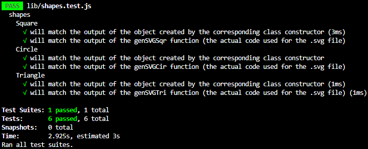

# .SVG Logo Generator

## Description
A node-based application that generates a SVG logo based on user input. It can be used to generate a logo in the shape of your choosing, with the text of your choosing, both in the color if your choosing.

I wanted to become more comfortable with Inquirer, Jest, and I knew absolutely nothing about .svg formatting or syntax. Making a .svg logo generator was a great way to improve in these fields.

I learned to make better use of separate files containing necessary functions to make things easier to read overall. I also dipped my toes into using regex to test against user input to determine whether or not it was a valid input field.

---

## Table of Contents

- [Installation](#installation)
- [Usage](#usage)
- [Technologies](#technologies)
- [Tests](#tests)
- [Credits](#credits)

---
## Installation

To install the application you'll need to do the following:

- Clone the repository to your local machine
- Navigate to the project repository
- type `npm install` in the terminal to install dependencies

---

## Usage

A short video demonstration can be found here: [Click here!](https://drive.google.com/file/d/1FhkhfaDvoTjCJ1lxWKSpszvWvi_zjfDr/view?pli=1)

After being invoked in the terminal the user will be prompted with several input fields and options. Once all fields have been entered/chosen the ./dist/logo.svg file will be created using said choices. If at any point the user wishes to create another it will overwrite the existing logo.svg file.

---

## Technologies

[Inquirer 8.2.4](https://www.npmjs.com/package/inquirer) - Used to gather information from the user and store those inputs to be utilized in generating the .svg file.

[Jest 24.9.0](https://jestjs.io/) - Used to test the .svg generating functions and make sure they are properly outputting what is expected.

---

## Tests

I wrote multiple tests for this application using the Jest package, really two tests applied each one time to each different shape used.

The first set of tests were designed to ensure that data was being properly pulled from the user inputs through the Inquirer package.

The second set of tests were designed to ensure that the generation functions were outputting the correct string of text to the logo.svg file.

---

## Credits

[Stack Overflow](https://stackoverflow.com/a/65190734) - Incorporating the 'validate:' functionality into my questions.js to be used with the Inquirer package.

[Stack Overflow](https://stackoverflow.com/a/51585212) - Incorporating the 'when:' functionality into my questions.js to be used with the Inquirer package.

[regex101.con](https://regex101.com/) - How to use regex to .test() a string for matches.

---

[return to top](#description)